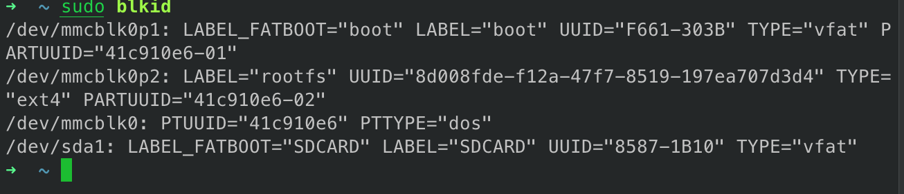
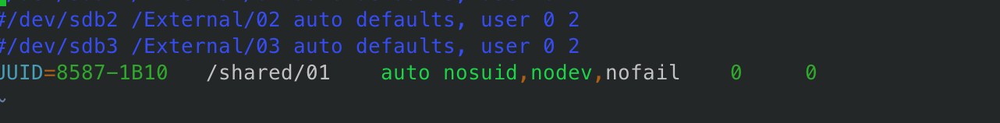

# How to mount the external disk in linux using fstab file?

find the uuid of the divices added to your linux.

```bash
sudo blkid
 ```

 
 Note down the UUID number of the device you want to mount. Open the fstab file using any of the text editor.

```bash
sudo vim /etc/fstab
 ```

  
  
  ```txt
UUID=8587-1B10   /shared/01    auto nosuid,nodev,nofail    0     0
  ```

so in this case the device will be mounted on the */shared/01* path. You can mount to any of your path. You have to create the directory before or after modifing the *fstab* file.

Now reboot your device.

```bash
sudo reboot
 ```

your external device will be mounted on the location after the boot up.
